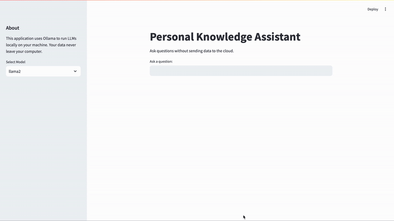

# Personal Knowledge Assistant

This application allows you to run Large Language Models (LLMs) locally using **Ollama** to query your private documents securely, without sending data to the cloud.

## Features
- Run LLMs locally using **Ollama**
- Query private documents securely
- Supports **LLaMA 2, Mistral, and Vicuna** models
- Simple Streamlit UI for interaction

## Installation
### Prerequisites
- Python 3.8+
- Ollama installed ([Download Ollama](https://ollama.com))
- Streamlit installed (`pip install streamlit`)

### Steps
1. Clone the repository:
   ```sh
   git clone <repository-url>
   cd <repository-name>
   ```
2. Install dependencies:
   ```sh
   pip install -r requirements.txt
   ```
3. Run the application:
   ```sh
   streamlit run app.py
   ```

## Usage
- Upload your text documents to the `./documents` directory.
- Select a model from the sidebar.
- Ask questions, and get responses based on your documents.

## Architecture
- **Streamlit UI** for user interaction.
- **PersonalKnowledgeAssistant** for document processing and querying.
- **Ollama API** for local LLM inference.
## Demo


## License
This project is licensed under the MIT License.

